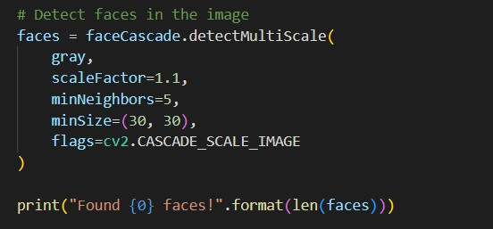
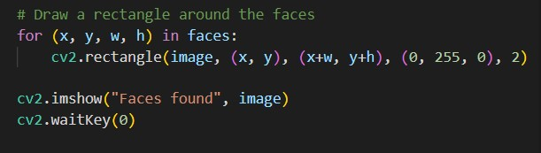
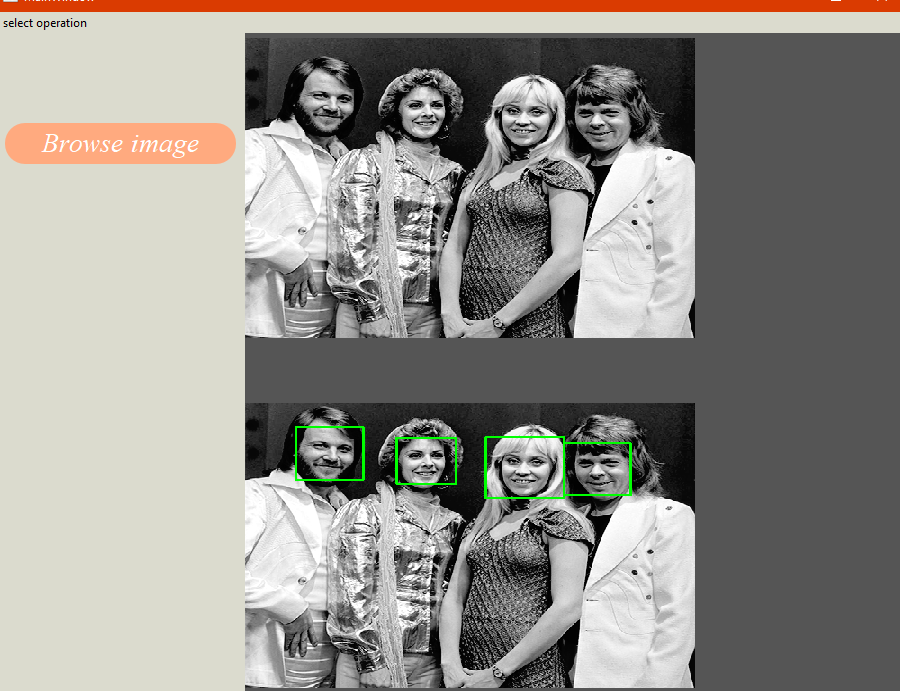
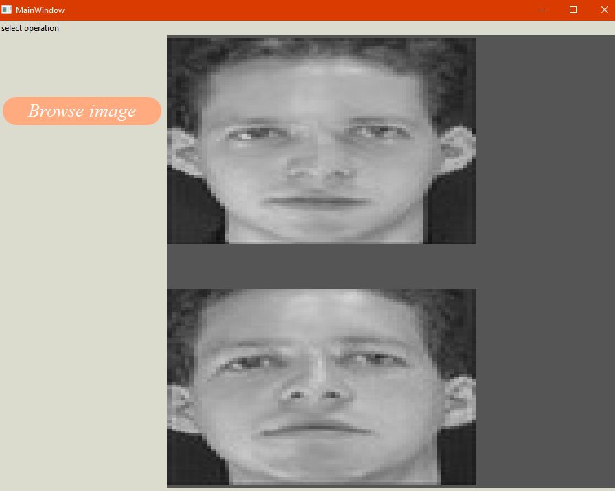
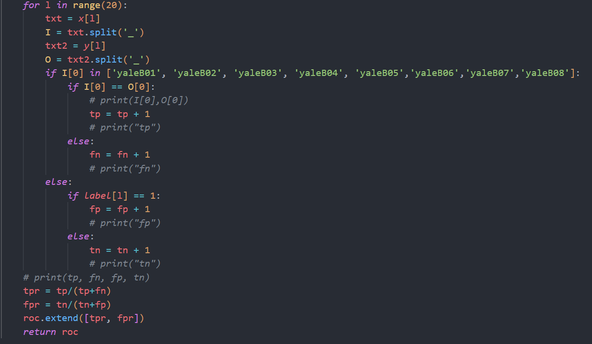
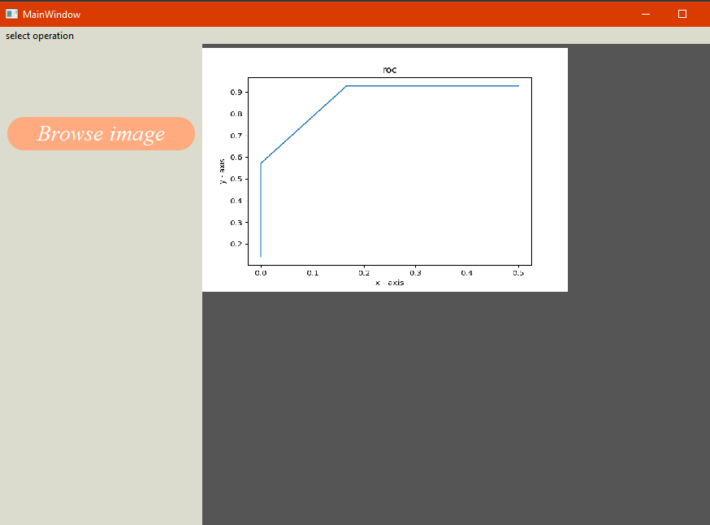

# Task 5

## **Team 6**

**Team Members:-**

| Name                           |  Sec  |  BN |
| :----------------------------- | :---: | --: |
| Alaa Seif elnasr Ibrahim       |   1   |  11 |
| Ahmed mohamed farouk           |   1   |   6 |
| Habiba Mahmoud                 |   1   |  25 |
| Hasan Hosni                    |   1   |  26 |
| Mariam Galal Mohamad           |   2   |  25 |
| ahmed.hasan28@eng-st.cu.edu.eg | Email |

## libraries

| library |  vesion  |
| :------ | :------: |
| opencv  | 4.5.1.48 |
| numpy   |  1.18.5  |
| PyQt    |    5     |

# 1. Face Detection

## 1.1 Algorithm

### - For something like a face, you might have 6,000 or more classifiers, all of which must match for a face to be detected (within error limits, of course). But therein lies the problem: for face detection, the algorithm starts at the top left of a picture and moves down across small blocks of data, looking at each block, constantly asking, “Is this a face? … Is this a face? … Is this a face?” Since there are 6,000 or more tests per block, you might have millions of calculations to do, which will grind your computer to a halt.

### - To overcome this problem we will use OpenCV cascade which will breaks the problem of detecting faces into multiple stages. For each block, it does a very rough and quick test. If that passes, it does a slightly more detailed test, and so on. The algorithm may have 30 to 50 of these stages or cascades, and it will only detect a face if all stages pass.

### - The advantage is that the majority of the picture will return a negative during the first few stages, which means the algorithm won’t waste time testing all 6,000 features on it. Instead of taking hours, face detection can now be done in real time.

## 1.2 Code Description

### We will use the haarcascade_frontalface_default.xml.

## The code will be divided into two parts:

### The first part the function that detect the faces in the image:



### The detectMultiScale function is a general function that detects objects. And here it will detect the faces as we are calling it on face cascade

### - The first argument is the gray scale image

### - The second argument is the scale factor, which is used to adjust the faces that the faces that are closer to the camera may appear bigger than the faces in the back

### - The third argument is minNeighbors, it defines how many objects are detected near the current window before it declares the face found.

### - The minSize, gives the size of each window

### The function returns a list of rectangles which belives it founds a face

### The function returns 4 values x, y of the rectangle and width and height of the rectangle

### The Second Part:



### We will loop over this list returned from the function to draw the rectangles on the found faces on the image using the built in function .rectangle

## 1.3 Results




# 2. Face Recognition
## 2.1. Algorithm
- PCA is a dimensionality reduction method which can be used to define a new space 
with a highly reduced number of dimensions
- We first select the folder of images samples (train data) then read all data and 
store it in an array ```python FaceRecongnition.__FaceMatrix```
- Then we calculate the mean image and subtract it from all images in the array
using this method ```python FaceRecongnition.__getZeroMeanMatrix```
- Then we calculate the covariance matrix and get the eigen values, eigen 
vectors and eigen faces for the system using this method ```python FaceRecongnition.__getCovarianceMatrix ```
## In face detection function.
- We read the image, convert it to gray scale ,resize then put image in vector shape
- subtract image from mean of training data
-  got the projection of input image by of multiplying 90% of engine faces and mean subtracted image.
-we choice 3000 as the threshold of detect if there is face or no . 
- We  got the difference between the original face image vector and the projected vector. and compare the square difference and our threshold,if the distance is less than the threshold then they is face in the image else there is no face in the image
## In face recognition
- we need to find the close one of our data set to the input image we choose 3000 as the threshold of the distance between the our input image and our data set images . 
- We iterate for all images in our data set and get the distance between the input image and each one in the data set.we get euclidean distance and we get the small distance the we get our matched image . 
- We compared the distance with our threshold if the distance is small than the threshold we confirmed the matched image if not , we will print no matched image with the input image.
 
## 2.2. Results



# 3.Roc
## 3.1 Algorithm is done by sending different thresholdings to the face recognition function, the threshold controls the number of the weights of the compared tested image with the projected eigenfaces matrix
- we depended on the the first syllable of the names of images to classify it if it is from the train dataset or not so it has 2 probabilities true positive or false negative if the tested image for a person from dataset 
- if the image is for a person not from dataset the face recognition function sends a label contains 0 or 1 if the image is predicted or not so the counter of the true negative or false positive is incremented 
- then plotting ROC curve between the true positive rate and false positive rate 


        the 4 parameters calculation

## 3.2. Results



